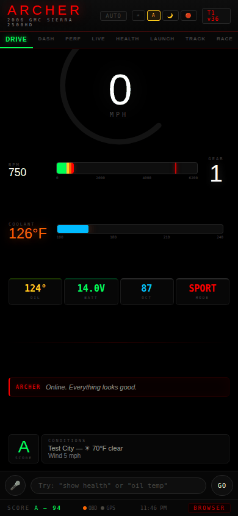
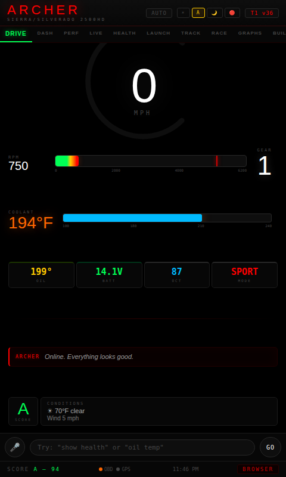
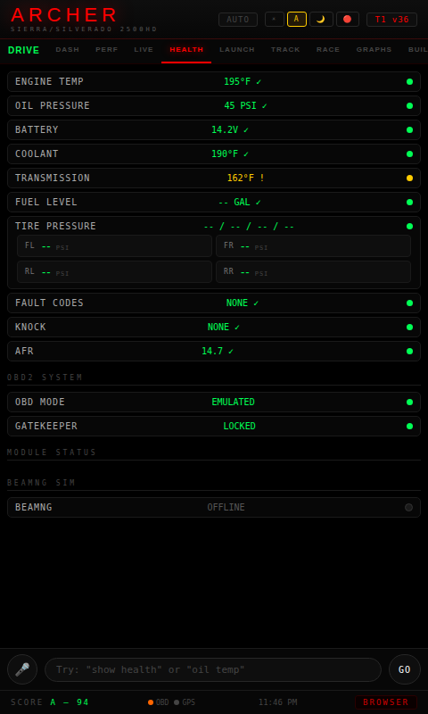
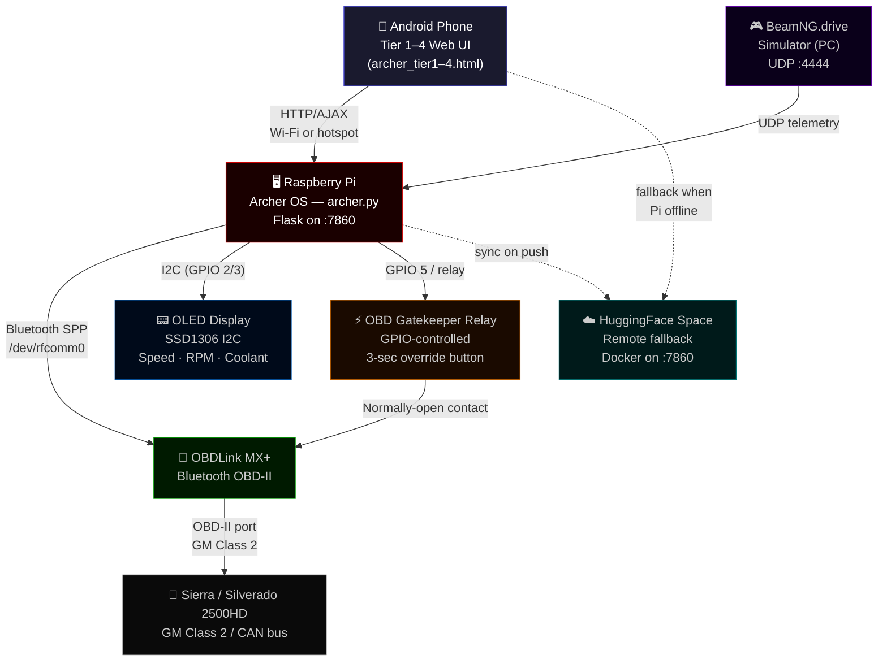

# Archer AI
**2006 Sierra/Silverado 2500HD — 6.0L LQ4 / 4L80E / 4x4 — Built by Ayden — Salem, Missouri**
*(GMC Sierra 2500HD SLT or Chevrolet Silverado 2500HD LT3 — same GMT800 platform, identical DTC database)*

Archer is a custom truck AI and dashboard system. It runs on a Raspberry Pi in the cab, syncs to a HuggingFace Space for remote access, and pairs with an Android app for voice commands and push notifications.

> ⚠️ **Before driving:** Read the [Hardware & Safety Checklist](docs/SAFETY.md)

---

## Demo



*Boot → DRIVE cockpit (speedometer arc, RPM bar, boost gauge) → HEALTH tab (OBD-II telemetry) → LIVE sensors → PERF screen.*

## Screenshots

| Drive (Tier 1) | Health (Tier 1) |
|:-:|:-:|
|  |  |

*Tier 1 (owner) cockpit — 480px phone portrait. Speedometer arc fills as speed increases. HEALTH tab shows live OBD-II telemetry with color-coded status dots.*

---

## Architecture



**Data flow at a glance:**
- The Pi polls the truck's OBD-II port via OBDLink MX+ every 200 ms and streams telemetry to the phone's browser over the local hotspot.
- The OBD gatekeeper relay sits between the Pi and OBD adapter — the Pi can cut the OBD connection on auth failure; a GPIO override button (hold 3 s) bypasses auth in an emergency.
- BeamNG.drive can inject sensor data over UDP for bench testing without the truck running.
- The HuggingFace Space is a Docker mirror of `archer.py` that the phone falls back to when the Pi is unreachable (read-only, no relay control).

---

## Offline / Failsafe

The truck operates **completely normally** without Archer. Archer only reads from and displays OBD data — it never writes to the ECU or controls any safety systems.

| Pi state | What happens |
|----------|-------------|
| Pi powered off / crashed | Truck runs normally. OBD port is unaffected. Phone shows "ARCHER OFFLINE — PI UNREACHABLE" after 4 seconds. |
| OBD adapter pulled while moving | No effect on engine or brakes. Archer loses telemetry and shows last known values. |
| Flask server crashed (Pi still on) | Restart via `sudo systemctl restart archer`. OLED goes blank after 5 s stale data. |
| Relay stuck open (gatekeeper failure) | Remove the OBD adapter from the port — relay failure has zero effect on the vehicle. |
| Phone app closed while driving | Truck continues normally. No autonomous actions are ever taken. |

---

## Features

| Feature | Details |
|---------|---------|
| OBD-II live telemetry | RPM, speed, coolant, IAT, MAF, throttle, boost, fuel trims, ethanol% |
| Voice AI | Groq Llama / Gemini — hands-free commands while driving |
| Drag timer | Stage + launch, 60ft/330ft/660ft/1000ft/1320ft splits via TTS |
| Build tracker | Parts list with status (planned/ordered/installed), HP/TQ gains |
| Spotify | Full playback control, DJ mode, playlist browser |
| Weather | Current conditions + compare two locations |
| Navigation | Saved places, go-home shortcut |
| Fan page | Guest access tier with Q&A |
| Pi tunnel | Raspberry Pi registers its ngrok/cloudflare URL for remote shell access |
| Security | 4-tier auth (owner PIN, MAC whitelist, invite code, guest), CSRF, rate limiting |

---

## Access Tiers

| Tier | Who | Access |
|------|-----|--------|
| 1 — Owner | Ayden | Full control — all features, admin, terminal |
| 2 — Passenger | Trusted passengers | Dashboard, Spotify, voice, drag timer |
| 3 — Family | Family members | Read-only dashboard, weather, Spotify |
| 4 — Valet | Valet / temporary | Speed limit enforced, no sensitive controls |
| Fan | Public | Q&A chatbot only |

Auth is done by MAC address (auto-login for registered devices), owner PIN, or invite code. Codes can be revoked at any time from the admin panel.

---

## Hardware

### Required
- Raspberry Pi 4 (2GB+ RAM)
- OBDLink MX+ (Bluetooth) or compatible OBD-II adapter on `/dev/ttyUSB0`
- Android phone running the Archer app

### Optional
- Arduino Uno — gauge/lighting control via `/dev/ttyACM0`
- OLED display (SSD1306 I2C) — local fallback display when phone is not nearby
- Mirror display — Raspberry Pi HDMI output for heads-up mirror mode

### Wiring Diagram (Arduino)

```
Arduino Uno                 Sierra Fuse Box / Battery
-----------                 ---------------
Pin 2  ──── Tach signal (from coil 1 low-side or tach terminal)
Pin 3  ──── Boost signal (0-5V from MAP sensor tap)
Pin A0 ──── Fuel level sender (0-90Ω → 0-5V via resistor divider)
Pin A1 ──── Aux battery voltage (via 10kΩ/3.3kΩ divider — see below)
GND    ──── Ground (chassis ground, battery negative)
Vin    ──── +12V (switched, through 7805 regulator to 5V)

Fan relay board (if installed):
Pin 7  ──── Fan relay IN1 (low-side trigger, active-low)
Pin 8  ──── Fan relay IN2 (spare)

Aux battery voltage divider (dual-battery mod — future install):
  Aux (+) ── 10kΩ ── A1 ── 3.3kΩ ── GND
  Sketch: archer-os/arduino/aux_battery_monitor.ino
  Sends "AUX_BATT:12.84" over serial; Archer reads it automatically.
  HEALTH tab shows "-- PENDING MOD" until this is wired up.
```

### OLED Wiring (I2C)

```
SSD1306       Raspberry Pi 4
-------       ---------------
VCC   ──────  Pin 1  (3.3V)
GND   ──────  Pin 6  (GND)
SCL   ──────  Pin 5  (GPIO 3 / SCL1)
SDA   ──────  Pin 3  (GPIO 2 / SDA1)
```

---

## Setup

### Local (Raspberry Pi)

```bash
# 1. Clone the repo
git clone https://github.com/acbrewer12/Archer.git
cd Archer

# 2. Create your env file (NEVER commit this)
cp archer.env.example archer.env
nano archer.env   # fill in your keys

# 3. Install dependencies
pip install -r requirements.txt

# 4. Run
python archer.py
# Opens on http://0.0.0.0:7860
```

### archer.env Format

```ini
ARCHER_SECRET=your-random-32-char-secret
ARCHER_OWNER_PIN=1234
GROQ_API_KEY=gsk_...
SPOTIFY_CLIENT_ID=...
SPOTIFY_CLIENT_SECRET=...
WEATHERAPI_KEY=...
FIREBASE_SERVICE_ACCOUNT_JSON={"type":"service_account",...}
```

**Never commit `archer.env` — it's in `.gitignore`.**

### HuggingFace Deployment

Set these as GitHub Secrets (Settings → Secrets → Actions):

```
HF_TOKEN                      ← your HuggingFace write token
ARCHER_SECRET                 ← same as local
GROQ_API_KEY
SPOTIFY_CLIENT_ID
SPOTIFY_CLIENT_SECRET
WEATHERAPI_KEY
FIREBASE_SERVICE_ACCOUNT_JSON
```

The `sync-to-hf.yml` workflow pushes to `aydencatman/Archer` Space on every push to `main`.

---

## Archer Key (USB)

The `usb-tools/` folder contains portable utilities for the truck. Flash them to a USB drive labeled `ARCHER_KEY`:

```
ARCHER_KEY/
├── archer-os/     ← Raspberry Pi OS image (if rebuilding)
├── usb-tools/     ← Diagnostic scripts, OBD reader, fan control
└── sync.sh        ← Sync Pi to latest GitHub main
```

To update the Pi from the USB:
```bash
bash /media/pi/ARCHER_KEY/sync.sh
```

---

## Voice Commands

Say any of these after the wake word (or via the Android app push-to-talk):

| Category | Commands |
|----------|---------|
| Engine | "rpm", "speed", "temperature", "boost", "battery", "health" |
| Drag | "start drag run", "launch", "drag stats" |
| Spotify | "play", "pause", "next", "skip", "volume up", "volume down" |
| Weather | "weather", "weather compare [city1] vs [city2]" |
| Navigation | "go home", "go to [saved place]" |
| System | "maintenance on", "maintenance off", "tire pressure" |
| Help | "help", "what can you do", "commands" |

---

## Troubleshooting

### OBD Not Connecting
1. Check that OBDLink MX+ is paired via Bluetooth: `bluetoothctl paired-devices`
2. Verify the port: `ls /dev/rfcomm* /dev/ttyUSB*`
3. Set `OBD_PORT=/dev/rfcomm0` in `archer.env`
4. If no hardware available, set `USE_EMULATOR=true` for simulated data

### Mirror Display Not Showing
1. Confirm Pi HDMI output is active: `tvservice -s`
2. Navigate to `http://[pi-ip]:7860/mirror` in Chromium (kiosk mode)
3. Add to `/etc/xdg/autostart/` for boot launch

### Push Notifications Not Working
1. Verify `FIREBASE_SERVICE_ACCOUNT_JSON` is set in env/secrets
2. Check that `google-services.json` is placed in the Android app's `app/` folder (never commit it)
3. Look at `/logs` for `FCM_SEND` events

### Common Python Errors
| Error | Fix |
|-------|-----|
| `ModuleNotFoundError: archer_state` | Ensure `archer_state.py` is present; `sync-to-hf.yml` copies it now |
| `No module named 'obd'` | `pip install obd` or set `USE_EMULATOR=true` |
| `CSRF validation failed` | Front-end must call `/csrf_token` first and pass `X-CSRF-Token` header |

---

## API

> **Full API reference → [docs/API.md](docs/API.md)**
>
> Documents every Flask endpoint: auth tiers, request/response shapes, rate limits, and how to extend Archer.

---

## Safety

> **Full safety checklist → [docs/SAFETY.md](docs/SAFETY.md)**
>
> Covers pre-drive checklist, OBD gatekeeper checks, emergency override switch, Pi hardware checklist, and emergency procedures.

Quick pre-drive check before every drive:

- [ ] OBD adapter secured (not dangling from the port)
- [ ] Phone mounted on dash — not held
- [ ] Voice commands tested at standstill first
- [ ] `maintenance_mode` is OFF (no false brake/engine warnings)
- [ ] Pi power cable routed away from gear shift
- [ ] Mirror display brightness appropriate for night driving

---

## License

Private — built for personal use on a single vehicle. Not for redistribution.
